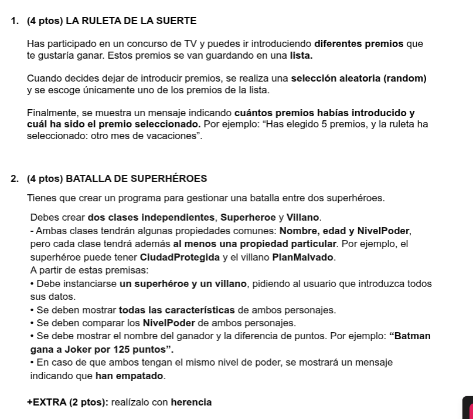

# Examen Java - Curso Ironhack




## Estructura del Proyecto

```text
examen-java/
├── MenuPrincipal.java              # Menú interactivo para ejecutar cualquiera de los dos ejercicios
├── README.md                       # Documentación y guía de ejecución
├── ejercicio1/
│   └── RuletaDeLaSuerte.java       # Ejercicio 1: Concurso TV - Ruleta de la suerte
└── ejercicio2/
    ├── Personaje.java              # Clase Base con propiedades comunes (Herencia)
    ├── Superheroe.java             # Subclase con propiedad 'ciudadProtegida'
    ├── Villano.java                # Subclase con propiedad 'planMalvado'
    └── BatallaSuperheroes.java     # Clase ejecutable con lógica de combate
```

